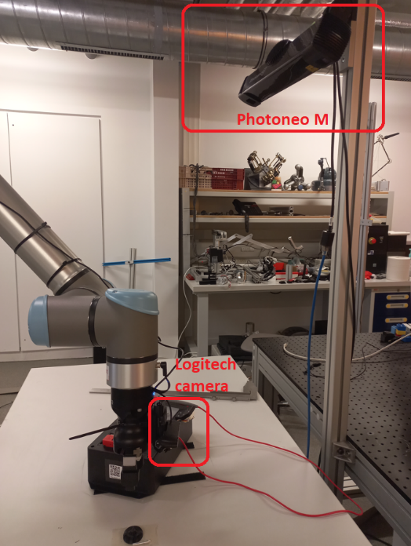
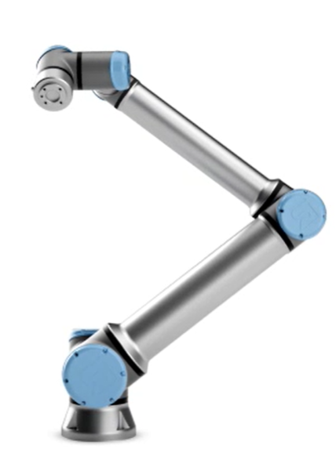
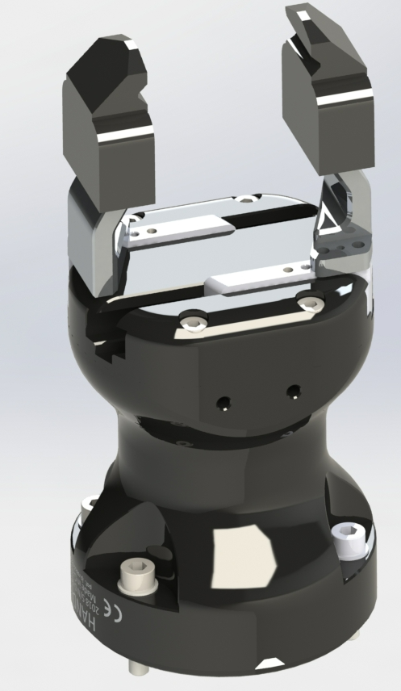
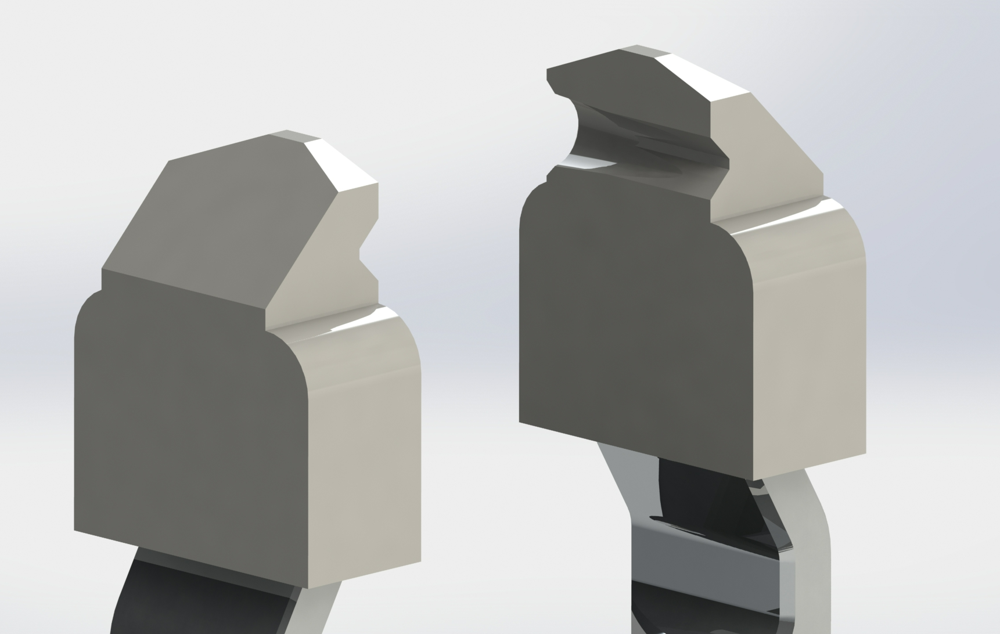
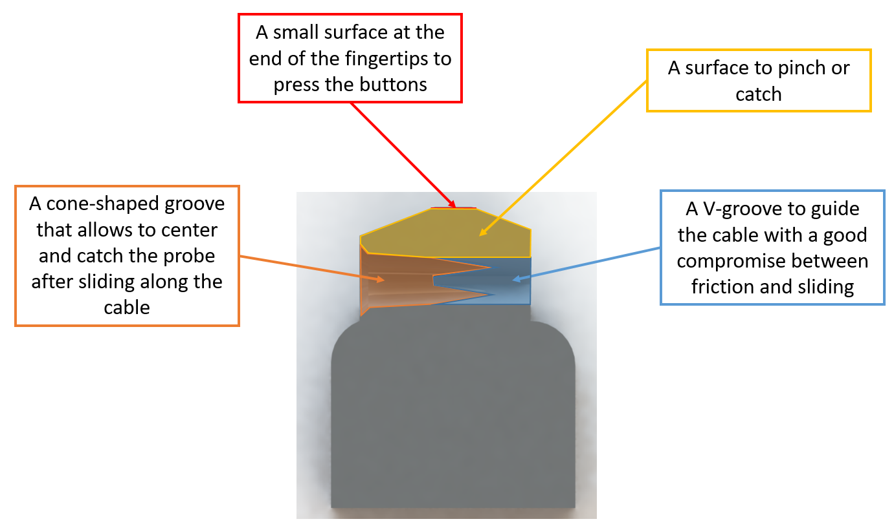
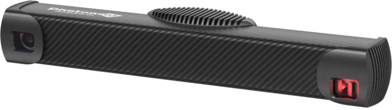
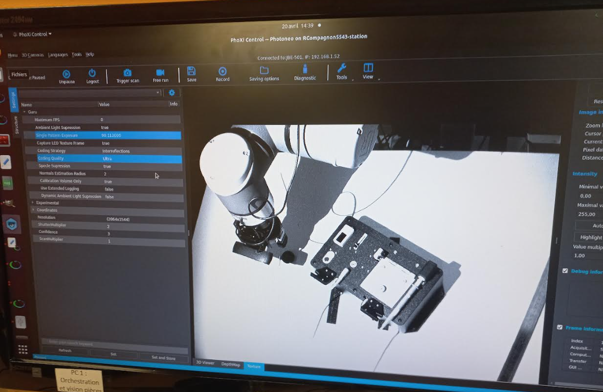
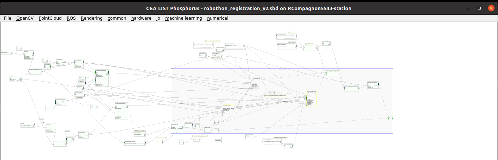
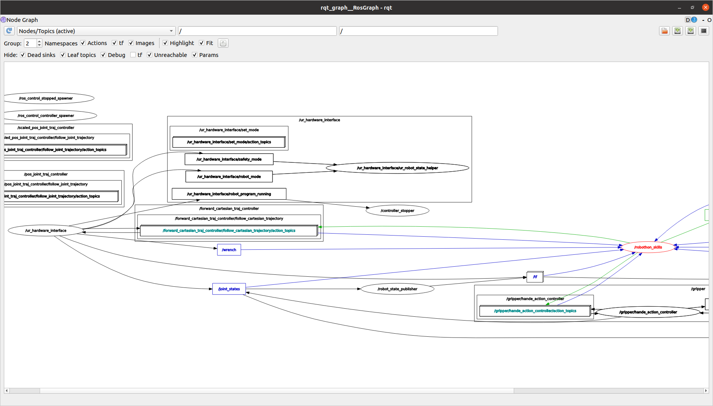
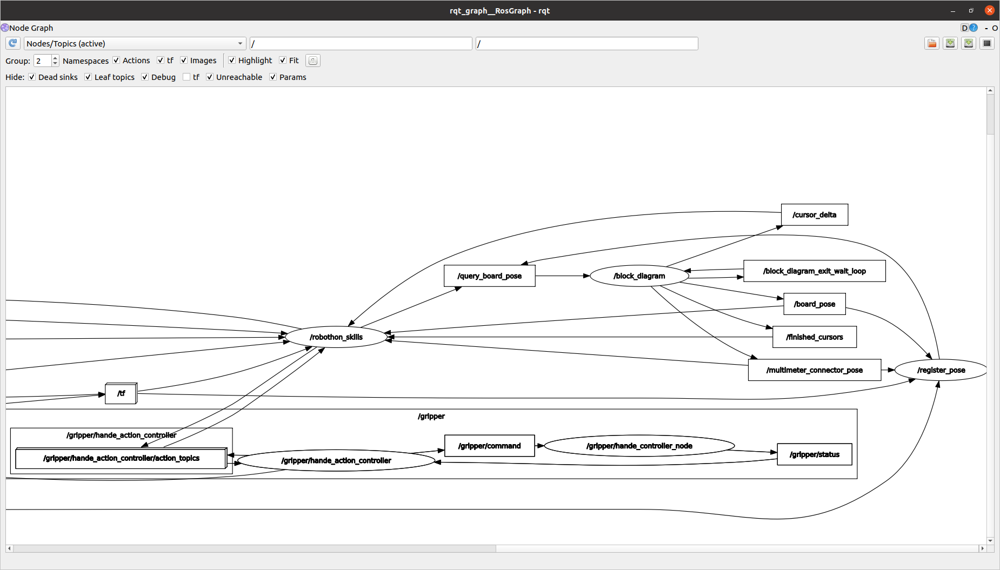

# OSCAR Team Robothon2023 documentation

## Equipment used list

### Overall setup

The following images give an overview of the robotic setup. The main visible components are:

- UR10e
- Robotiq Hand-E gripper with custom fingertips
- Photoneo M 3D scanner
- Webcam Logitech C920 mounted on robot wrist for slider adjustment
- Webcam Logitech C920 mounted on multimeter for the BYOD task

### Robot

The current setup uses a 6 DOF UR10e collaborative robot.
Robot control is done using the low level UR External Control Interface, connected to our ROS controller. 

### Gripper and custom fingertips
We designed our own custom 3D printed fingertips in order to improved dexterity and be able to all the tasks. Those fingertips provide four surfaces of interest:

We connected the gripper to the robot and used a standard ROS controller for robotiq gripper to control the clamping force, the finger spacing, and the opening speed.

### Localization

Localization of the board is done with a _Photoneo PhoXi M_ 3D scanner (https://www.photoneo.com/products/phoxi-scan-m/).
The Photoneo is placed on a fixed pole, calibration with relation to the robot is done once. 

The photoneo provides a 3D pointcloud of the scanned area, which is used to compute pose transformation of the taskboard, between a reference position and the current position. Next image provides an illustration of a typical photoneo scan.

The same 6 DOF registration pipeline is used to localize the cable pin at the beginning of task 3.

### Visual Servoing for slider adjustment

In task 2, the wrist webcam is used to segment the cursors area and find the cursors in it. Then, the mouvement of the slider is ajusted with this visual feedback.

### Bring-your-own-device (BYOD) Challenge

We chose to probe a group of LR06 batteries. To do so, we use our vision system to localize the batteries, then grasp them one by one and insert them in a custom 3D printed lodging. The lodging can hold one of the multimeter probes, allowing our one-handed robot to do the measurement with the other probe. A webcam provides the multimeter image to perform character recognition and retrieve the battery voltage.

## Software dependency list

The main software modules needed to operate the system are:
- CEA LIST Phosphor framework: Phosphor is a tool combining a user GUI and an execution engine, dedicated to graphical design of vision-based algorithms. It is based on dataflow diagrams, and provides a rich library of algorithms both developped at CEA and from well-known third party libraries such as open-cv and so on. 
- ROS (Melodic): used as a communication middleware to trig Phosphorus frameworks, and control both the robot and the gripper with actions. We chose to use the [forward cartesian trajectory controller]([url](https://github.com/UniversalRobots/Universal_Robots_ROS_Driver/blob/master/ur_robot_driver/doc/controllers.md#forward_cartesian_traj_controller)), so that the trajectory generation is done on the robot itself, which we found out was more efficient and less hazardous than using MoveIt!. The whole process is done with position control.

The Phosphorus diagram for the Photoneo object localization features:

Those modules use various third party C++ and Python libraries, all of them being open-source projects, such as :
- Cuda: for acceleration in object localization pipeline
- Vulkan: for renderings in object localization pipeline
- Eigen: for C++ matrix computations
- Numpy: for python mathematical computations
- Open-CV: for 2D/3D image computation
- actionlib : this is the basic library to use ROS actions
- Universal Robot ROS driver
- ur_robot_driver: http://wiki.ros.org/ur_robot_driver

## Quick start guide
The typical execution workflow follows these steps. All supervision is done from the "skills" computer. 

### Robot
• Start the robot  
• Activate the gripper : Installation / Tool I/O --> Communication Interface (leave default parameters) & 24V  
• Make sure the gripper works : Programs / URCaps --> Gripper Activate --> Reset and activate  
• Allow external control : Programs / URCaps --> Control by ($IP_ADDRESS) --> Play  

### Vision Computer
In a terminal :  
• launch PhoXiControl  
cd /opt/Photoneo/PhoXiControl-1.7.2/bin  
./PhoXiControl  
• launch block_diagram  

### Robot Computer
export ROS_IP=$IP_ADDRESS 
roslaunch robothon2023_pkg controllers.launch  

### Record a pose
roslaunch robothon2023_pkg controllers.launch  
rosrun robothon2023_pkg register_pose.py  
You can choose to register the joints pose or the TCP pose either in robot or board frame (you will be prompted the question and the node will wait for your input).
This will either be saved in ~/newrobothon_ws/src/robothon2023_pkg/bagfiles/registered_pose_robot.md, registered_pose_board.md or registered_pose_joints.md depending on your choice.

You can find positions of the important points of the board in the board base in ~/newrobothon_ws/src/robothon2023_pkg/bagfiles/position_robothon.txt (taken from a scan of the board in MeshLab)
