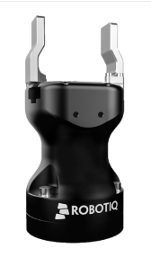

# OSCAR Team Robothon2023 documentation

## Equipment used list

### Overall setup

The following images give an overview of the robotic setup. The main visible components are:

- UR10e
- Robotiq Hand-E gripper
- Photoneo M 3D scanner
- Webcam Logitech C920 mounted on robot wrist for slider adjustment
- Webcam Logitech C920 mounted on multimeter for the BYOD task

### Robot

The current setup uses a 6 DOF UR10e collaborative robot.
Robot control is done using the low level UR External Control Interface, connected to our ROS controller. 

### Gripper
[TODO]
We use the Robotiq Hand-E gripper, with custom 3D printed fingertips. 
Those fingertips provide 3 surfaces of interest for improved dexterity, as illustrated in the next figure:
- clamping surface: the main gripping area, approx. 30x30mm, covered with rubber for improved gripping capability. Used for general grasping tasks.
- pressing surface: the tip of each jaw is covered with rubber (approx. 10x30mm) to enable shear forces application. Used for battery lid removal.
- steel blade: each jaw is equipped with a small (non cutting) steel blade, to provide fine poking and clawing capability. Used for batteries removal.

### Localization

Localization of the board is done with a _Photoneo PhoXi M_ 3D scanner (https://www.photoneo.com/products/phoxi-scan-m/).
The Photoneo is placed on a fixed pole, calibration with relation to the robot is done once. 

The photoneo provides a 3D pointcloud of the scanned area, which is used to compute pose transformation of the taskboard, between a reference position and the current position. Next image provides an illustration of a typical photoneo scan.

The same 6 DOF registration pipeline is used to localize the cable pin at the beginning of task 3.

### Visual Servoing for slider adjustment

In task 2, the wrist webcam is used to segment the cursors area and find the cursors in it. Then, the mouvement of the slider is ajusted with this visual feedback.

### Bring-your-own-device (BYOD) Challenge

We chose to probe a group of LR06 batteries. To do so, we use our vision system to localize the batteries, then grasp then one by one and insert them in a custom 3D printed lodging. The lodging can hold one of the multimeter probes, allowing our one-handed robot to do the measurement with the other probe. A webcam provides the multimeter image to perform character recognition and retrieve the battery voltage.

## Software dependency list

The main software modules needed to operate the system are:
- CEA LIST Phosphorus framework: Phosphorus is a tool combining a user GUI and an execution engine, dedicated to graphical design of vision-based algorithms. It is based on dataflow diagrams, and provides a rich library of algorithms both developped at CEA and from well-known third party libraries such as open-cv and so on. 
- ROS: used as a communication middleware to trig Phosphorus frameworks, as well as a skill server.

The Phosphorus diagram for the Photoneo object localization features:

Those modules use various third party C++ and Python libraries, all of them being open-source projects, such as :
- Eigen : for C++ matrix computations
- Numpy : for python mathematical computations
- Open-CV : for 2D/3D image computation
- ROS : for communication and robot handling

## Quick start guide
[TODO]
The typical execution workflow follows these steps. All supervision is done from the "skills" computer. 

### Robot
• Start the robot  
• Activate the gripper : Installation / Tool I/O --> Communication Interface (leave default parameters) & 24V  
• Make sure the gripper works : Programs / URCaps --> Gripper Activate --> Reset and activate  
• Allow external control : Programs / URCaps --> Control by ($IP_ADDRESS) --> Play  

### Vision Computer
In a terminal :  
• launch PhoXiControl  
cd /opt/Photoneo/PhoXiControl-1.7.2/bin  
./PhoXiControl  
• launch block_diagram  

### Robot Computer
export ROS_IP=$IP_ADDRESS 
roslaunch robothon2023_pkg controllers.launch  

### Record a cartesian pose /!\ of the TCP in the robot base 
roslaunch robothon2023_pkg controllers.launch
rosrun robothon2023_pkg register_pose.py --> This will be saved in ~/newrobothon_ws/src/robothon2023_pkg/bagfiles/registered_pose.md

You can find positions of the important points of the board in the board base in ~/newrobothon_ws/src/robothon2023_pkg/bagfiles/position_robothon.txt (taken from a scan of the board in MeshLab)

### Record trajectory
rosbag record -O subset /joint_states/position

order of joints in joint_states :
  - elbow_joint == elbow
  - shoulder_lift_joint == shoulder
  - shoulder_pan_joint == base
  - wrist_1_joint
  - wrist_2_joint
  - wrist_3_joint
